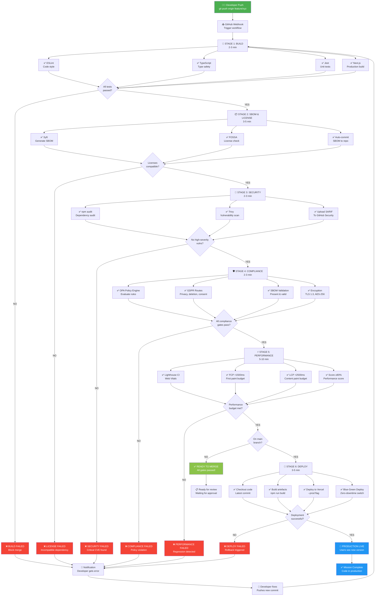
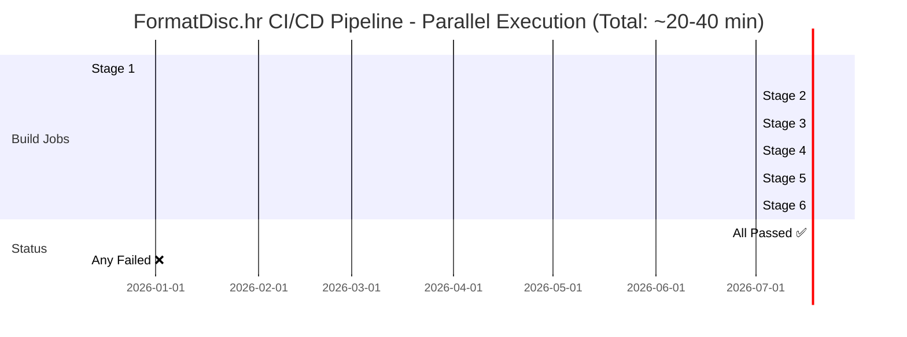
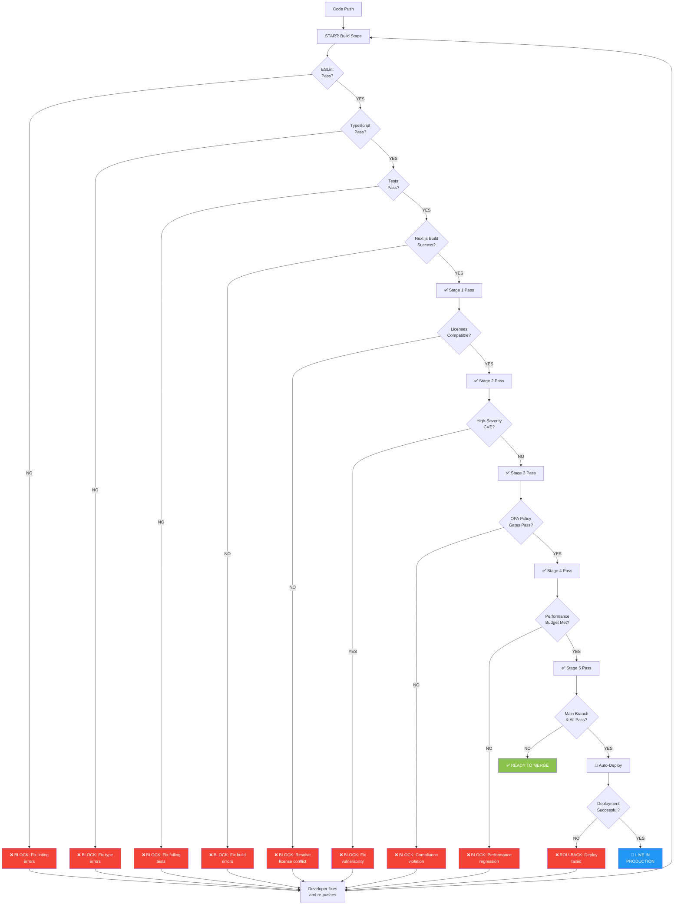
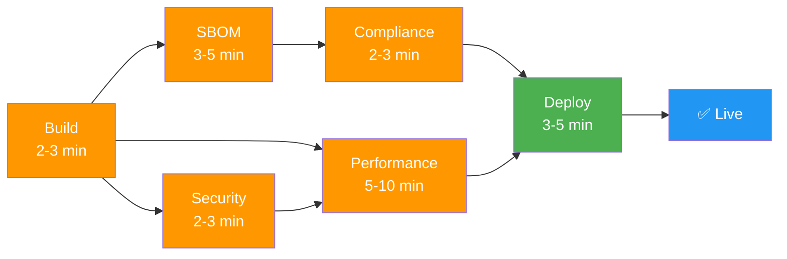
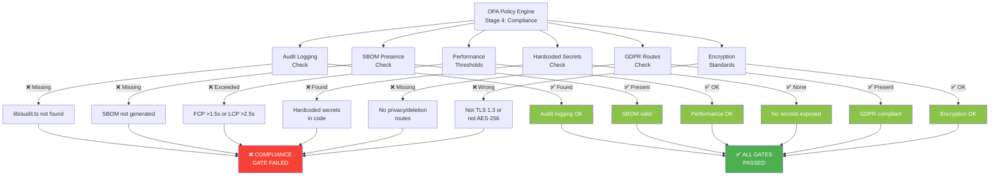
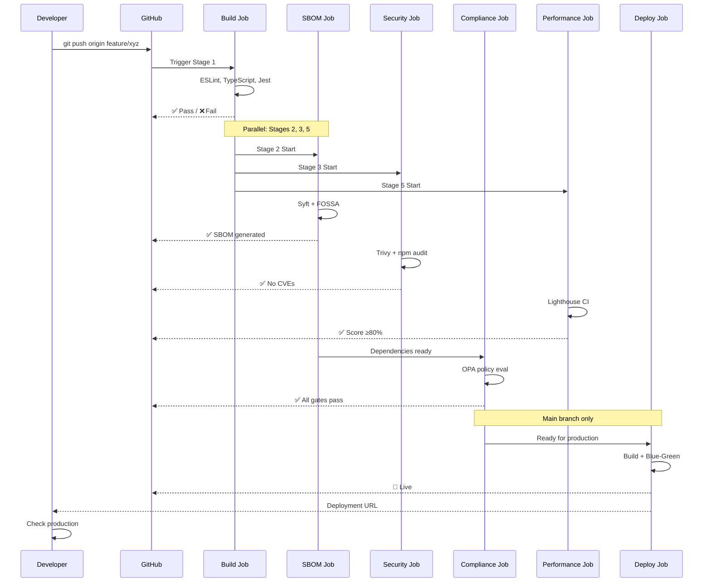
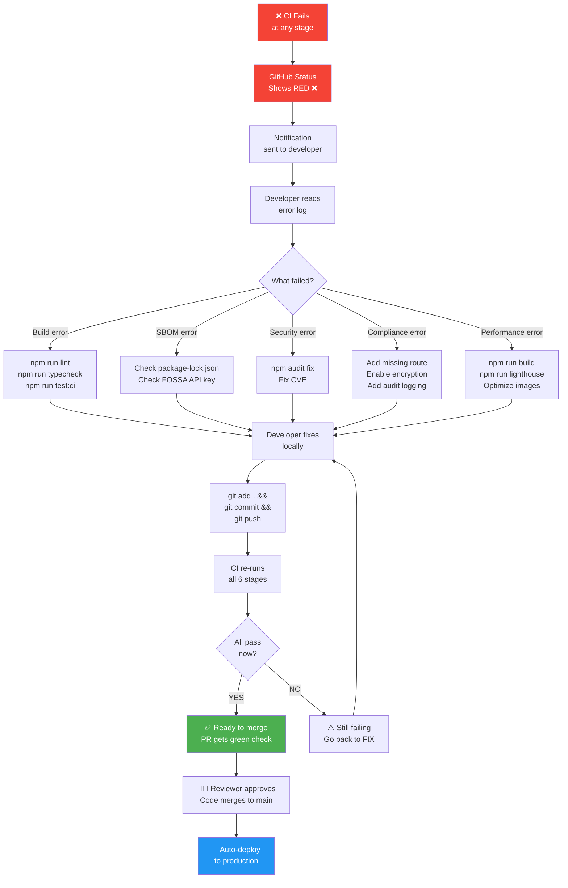

# 🔄 FormatDisc.hr CI/CD Pipeline - Visual Diagrams

## 1. Complete 6-Stage Pipeline Flow

---

## 2. Parallel Execution Timeline

---

## 3. Decision Tree (What Gets Blocked?)

---

## 4. Stage Dependencies & Parallelization

---

## 5. OPA Policy Gate Rules

---

## 6. What Happens After Each Stage

---

## 7. Timing Breakdown

| Stage | Min Time | Max Time | What Gets Checked | Blocker? |
|-------|----------|----------|-------------------|----------|
| **1. Build** | 2 min | 3 min | Lint, Types, Tests, Build | YES ❌ |
| **2. SBOM** | 3 min | 5 min | Dependencies, Licenses | YES ❌ |
| **3. Security** | 2 min | 3 min | npm audit, Trivy scan | YES ❌ |
| **4. Compliance** | 2 min | 3 min | OPA policy, GDPR, encryption | YES ❌ |
| **5. Performance** | 5 min | 10 min | Lighthouse, Web Vitals | YES ❌ |
| **6. Deploy** | 3 min | 5 min | Vercel blue-green | YES ❌ |
| | | | | |
| **Total (Sequential)** | 17 min | 29 min | All above | All |
| **Total (Parallel)** | 20 min | 40 min | All above | All |

**Note:** Stages 2, 3, 5 run in parallel after Stage 1 completes. Stage 4 runs after Stage 2. Stage 6 only runs after all previous stages pass AND push is to `main` branch.

---

## 8. Error Recovery Flow

---

## 📋 Quick Legend

| Symbol | Meaning |
|--------|---------|
| ✅ | Passed / Working |
| ❌ | Failed / Blocked |
| 🚀 | Deploy / Production |
| ⚡ | Performance / Speed |
| 🛡️ | Security / Compliance |
| 📦 | Packaging / Build artefacts |
| 📧 | Notification / Communication |
| 🔧 | Fix / Development |
| 🎉 | Success / Complete |

---

## 🎯 How to Read These Diagrams

1. **Complete Pipeline Flow (Diagram 1)** → See the whole process from push to production
2. **Timeline (Diagram 2)** → Understand which stages run in parallel
3. **Decision Tree (Diagram 3)** → What gets blocked and why
4. **Dependencies (Diagram 4)** → Which stages depend on which
5. **OPA Gates (Diagram 5)** → Compliance rules being enforced
6. **Sequence (Diagram 6)** → Step-by-step communication between systems
7. **Timing (Diagram 7)** → How long each stage takes
8. **Recovery (Diagram 8)** → How to fix failures and re-run

---

**Use these diagrams to:**
- 📚 Train new team members
- 🎓 Explain the pipeline to stakeholders
- 🐛 Debug CI failures
- 📊 Document the process
- 🚀 Understand deployment flow

Share with your team! 🌟
