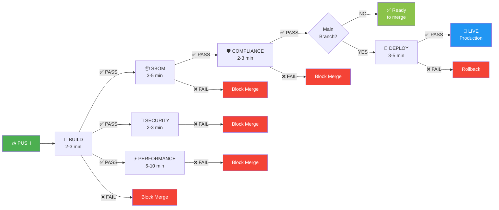

# 🚀 FormatDisc.hr - Quick Reference Card

## Your AI-Ready Enterprise SaaS Stack

### The 5-Phase Governance Pipeline

```
[1] CLIENT INPUT      [2] MVP SIM         [3] ORCHESTRATION   [4] COMPLIANCE      [5] PRODUCTION
     (2h)              (12h)                  (8h)                (4h)              (24h) → LIVE
     └─────────────────────────────────────────────────────────────────────────────────────→
     "Tell us your    "Test in sandbox   "Deploy models      "Verify GDPR/SOC2   "Zero-downtime
      requirements"    before paying"     & scale"            & generate SBOM"    blue-green"
```

---

## Critical Files You Need to Know

| File | What to Do | When |
|------|-----------|------|
| `.github/copilot-instructions.md` | **Read this first** - guides AI agents | Before any development |
| `.github/workflows/ci.yml` | Auto-runs on every push | Automatic on `git push` |
| `policy/compliance.rego` | Defines GDPR/SOC2 rules | Evaluated in CI stage 4 |
| `.env.example` | Copy to `.env.local` | Setup, before `npm i` |
| `README.md` | Architecture & tech stack | When joining project |

---

## The 6-Stage CI/CD Pipeline (at a Glance)



**Timeline**: Stages 2, 3, 5 run **in parallel** after Stage 1 completes  
**Total Time**: ~20-40 minutes per push  
**Full Details**: See [`PIPELINE_DIAGRAM.md`](PIPELINE_DIAGRAM.md) for 8 comprehensive Mermaid diagrams

---

## One-Liner Commands

```bash
# Setup
npm install                    # Install deps
npm run dev                   # Start dev server (localhost:3000)

# Before pushing
npm run lint                  # Check code style
npm run typecheck            # TypeScript errors
npm run test:ci              # Unit tests
npm run build                # Production build

# Deploy (automatic if on main, all CI passes)
git push origin main         # Triggers 6-stage pipeline
```

---

## Code Pattern Cheat Sheet

### Audit Logging (Required)
```typescript
import { logAuditEvent } from '@/lib/audit'

// Log every important action
await logAuditEvent('USER_CREATED', { userId, email, timestamp })
```

### Supabase Auth
```typescript
const supabase = createServerSupabaseClient()
const { data: { user } } = await supabase.auth.getUser()
```

### Stripe Payments
```typescript
const stripe = new Stripe(process.env.STRIPE_SECRET_KEY)
const intent = await stripe.paymentIntents.create({ amount, currency })
```

### Multi-Tenant DB Query
```typescript
const { data } = await supabase
  .from(`tenant_${tenantId}.projects`)
  .select('*')
```

### AI Streaming (Vercel AI SDK)
```typescript
const stream = createStreamableValue(
  streamText({ model: openai('gpt-4'), messages })
)
```

---

## GitHub Secrets You Must Add

| Secret | Get From | When |
|--------|----------|------|
| `VERCEL_TOKEN` | vercel.com/account/tokens | Before first deploy |
| `VERCEL_ORG_ID` | Vercel dashboard | Before first deploy |
| `VERCEL_PROJECT_ID` | Vercel project settings | Before first deploy |
| `FOSSA_API_KEY` | app.fossa.com | Optional, for license scan |
| `LHCI_GITHUB_APP_TOKEN` | GitHub Lighthouse app | Optional, for Lighthouse CI |

**To add:** Settings → Secrets and variables → Actions → New repository secret

---

## OPA Policy: What Gets Blocked?

Your `policy/compliance.rego` prevents:

❌ **No audit logging** - Must have `lib/audit.ts`  
❌ **No SBOM** - Must generate on every build  
❌ **Poor performance** - FCP >1500ms, LCP >2500ms, Score <80%  
❌ **Hardcoded secrets** - Never `API_KEY=sk_...` in code  
❌ **No GDPR routes** - Need privacy, deletion, consent endpoints  
❌ **Wrong encryption** - Must use TLS 1.3 + AES-256  

---

## Deployment Flow (What Happens When You Push)

```
git push origin main
         ↓
GitHub detects push → Triggers ci.yml workflow
         ↓
PARALLEL (all run at same time):
  ├─ Build job starts
  ├─ When Build done → SBOM starts
  ├─ When Build done → Security starts
  ├─ When Build done → Performance starts
  ├─ When SBOM+Security+Compliance done → Deploy starts
         ↓
All passed? YES ✅
         ↓
Deploy to Vercel (automatic blue-green)
         ↓
Production URL appears in GitHub Actions log
         ↓
Your users see new version (zero downtime!)
```

---

## Troubleshooting at a Glance

| Error | Fix |
|-------|-----|
| Build fails | Run `npm run lint && npm run build` locally |
| Type errors | Run `npm run typecheck` and fix |
| Tests fail | Run `npm run test:ci` locally |
| SBOM fails | Ensure `package-lock.json` committed |
| Lighthouse fails | Check performance budget in `lighthouserc.json` |
| Compliance fails | Check OPA policy in `policy/compliance.rego` |
| Deploy fails | Check Vercel token is valid in GitHub Secrets |

---

## Performance Targets (Must Meet to Merge)

| Metric | Target | Tool |
|--------|--------|------|
| First Contentful Paint (FCP) | <1500ms | Lighthouse CI |
| Largest Contentful Paint (LCP) | <2500ms | Lighthouse CI |
| Performance Score | ≥80% | Lighthouse CI |
| Cumulative Layout Shift | <0.1 | Lighthouse CI |
| API latency (p95) | <200ms | APM monitoring |

---

## Compliance Checkpoints (Auto-Enforced)

| Gate | Check | Tool |
|------|-------|------|
| GDPR | Privacy policy, deletion endpoint, consent | OPA |
| SOC2 | Encryption, audit logging, access control | OPA |
| HIPAA | Data classification, encryption at rest | OPA |
| Security | No vulnerabilities, npm audit pass | Trivy |
| Licenses | Compatible licenses, FOSSA approved | FOSSA |
| SBOM | Present, up-to-date CycloneDX format | Syft |

---

## Team Roles & Responsibilities

| Role | Must Do | Can Do |
|------|---------|--------|
| **AI Agent / Copilot** | Follow patterns in `.github/copilot-instructions.md` | Add audit logging automatically |
| **Developer** | Push to branch, watch CI pass | Review CI logs, understand failures |
| **Reviewer** | Approve PR after CI passes | Request performance/security reviews |
| **DevOps** | Monitor pipeline, update secrets | Adjust thresholds, add new gates |

---

## The Promise (48h to Production)

```
Your Vision
    ↓
Client Input (2h)          "We want X"
    ↓
MVP Simulation (12h)       "Here's X in sandbox"
    ↓
Orchestration (8h)         "Scaling X to production"
    ↓
Compliance (4h)            "GDPR ✅ SOC2 ✅ HIPAA ✅"
    ↓
Production (24h)           "X is now live"
    ↓
Your Users (Forever)       99.95% uptime guarantee
```

---

## Key Metrics Your Pipeline Tracks

- ✅ Code quality (lint, tests, types)
- ✅ Security (vulnerabilities, secrets, audit)
- ✅ Compliance (GDPR, SOC2, HIPAA gates)
- ✅ Performance (Web Vitals, Lighthouse)
- ✅ Deployment success (zero-downtime?)
- ✅ Audit trail (Loki, immutable logs)
- ✅ SBOM freshness (every build)

---

## Next Action Items

**Today (5 min):**
1. ✅ Read `.github/copilot-instructions.md`
2. ✅ Add GitHub Secrets (5 env vars)
3. ✅ Create `.env.local` from `.env.example`

**This Week (30 min):**
4. ✅ Set up GitHub Environments (staging, production)
5. ✅ Add branch protection rules
6. ✅ Push test branch, watch CI run

**This Month:**
7. ✅ Fine-tune OPA policies
8. ✅ Set up monitoring dashboards
9. ✅ Add Slack notifications

---

## Questions?

| Topic | See |
|-------|-----|
| Architecture | `README.md` § Technical & System Architecture |
| AI patterns | `.github/copilot-instructions.md` |
| CI/CD setup | `CI_CD_SETUP.md` |
| Compliance | `policy/compliance.rego` |
| Environment | `.env.example` |
| Checklist | `SETUP_COMPLETION.md` |

---

**Built for**: FormatDisc.hr Enterprise SaaS Platform  
**Powered by**: GitHub Actions + OPA + Vercel + Cloudflare  
**Guarantee**: 48h to production, zero downtime, 99.95% SLA

🚀 **Ready to push your first branch!**
